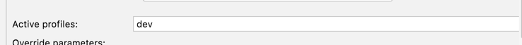

# Simple java project

This example uses Spring Boot. Java framework.

## Prerequisites

Install Java Development Kit 17

##Running app
If you prefer using IDE like Intellij IDEA. 
Run with dev profile to populate db


Or if you prefer to run with command line run with the following command
```bash
./gradlew bootRun --args='--spring.profiles.active=dev'
```

## Swagger UI available at
`http://localhost:8080/swagger-ui.html`

**Links:**
- [Java Development Kit 17](https://jdk.java.net/17/)
- [Spring Boot Official site](https://spring.io/projects/spring-boot)
- [Spring Boot Documentation](https://docs.spring.io/spring-boot/docs/current/)
- [Spring Boot Gradle Plugin](https://docs.spring.io/spring-boot/docs/current/reference/html/gradle-plugin.html)
- [Spring Boot Gradle Plugin Documentation](https://docs.spring.io/spring-boot/docs/current/reference/html/gradle-plugin.html)
- [IntelliJ IDEA Documentation](https://www.jetbrains.com/idea/documentation.html)
- [Lombok Documentation](https://projectlombok.org/features/all)
- [Telegram](https://telegram.org/)
- [Telegram Bot API](https://core.telegram.org/bots)
- [Java Telegram bot api](https://github.com/pengrad/java-telegram-bot-api)
- [Java Telegram bot api](https://github.com/JavaTelegramBot-API/JavaTelegramBot-API)
- [Creating a Bot using the Telegram Bot API](https://tutorials.botsfloor.com/creating-a-bot-using-the-telegram-bot-api-5d3caed3266d)
- [How to create a Telegram bot using java?](https://vaghelaviral.medium.com/how-to-create-a-telegram-bot-using-java-5710bed16c0f)
